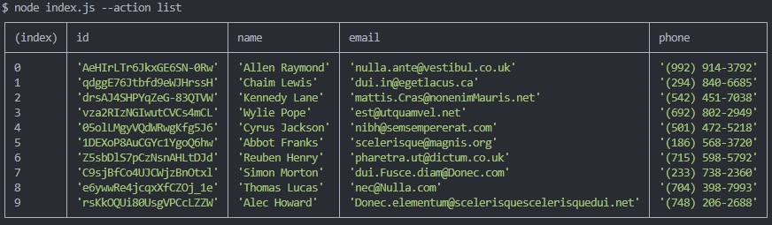
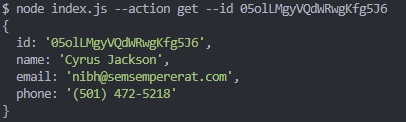
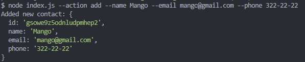
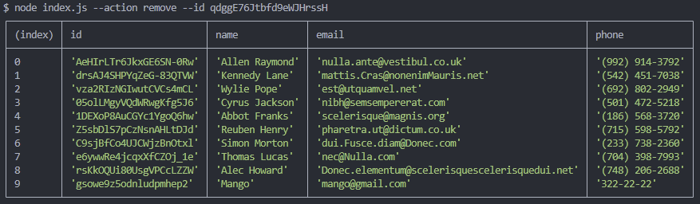

# Contacts manager in Node.JS

This application is a command-line interface (CLI) for managing contacts using Node.js. The application allows users to list, add, get, and remove contacts stored in a JSON file. It demonstrates the use of file operations, command-line argument parsing, and basic error handling in Node.js.

## Features

- **List Contacts**: Display all contacts stored in the JSON file in a tabular format.
- **Get Contact by ID**: Retrieve a contact's details using their unique ID.
- **Add Contact**: Add a new contact with a name, email, and phone number to the list.
- **Remove Contact**: Remove a contact from the list using their unique ID.

## Usage Examples

### 1. List all contacts

To list all contacts and display them in a table format, use the following command:

```bash
node index.js --action list
```

Screenshot:  


### 2. Get contact by ID

To get the details of a contact using their unique ID, use the following command:

```bash
node index.js --action get --id 05olLMgyVQdWRwgKfg5J6
```

Screenshot:  


### 3. Add a new contact

To add a new contact to the list, use the following command:

```bash
node index.js --action add --name Mango --email mango@gmail.com --phone 322-22-22
```

Screenshot:  


### 4. Remove a contact

To remove a contact from the list using their unique ID, use the following command:

```bash
node index.js --action remove --id qdggE76Jtbfd9eWJHrssH
```

Screenshot:  


## How to Run the Project

1. Clone this repository to your local machine.
2. Navigate to the project directory.
3. Install the dependencies using npm:

```bash
npm install
```

4. Run the application using npm scripts:

```bash
npm start -- --action [action] --name [name] --email [email] --phone [phone] --id [id]
```

## Available Actions

- `list` - Lists all contacts.
- `get` - Gets a contact by ID. Requires `--id` argument.
- `add` - Adds a new contact. Requires `--name`, `--email`, and `--phone` arguments.
- `remove` - Removes a contact by ID. Requires `--id` argument.

## Project Structure

- `index.js` - Entry point for the application.
- `contacts.js` - Contains functions for performing operations on contacts.
- `contacts.json` - JSON file where contacts are stored.
- `db/` - Directory containing the `contacts.json` file.
